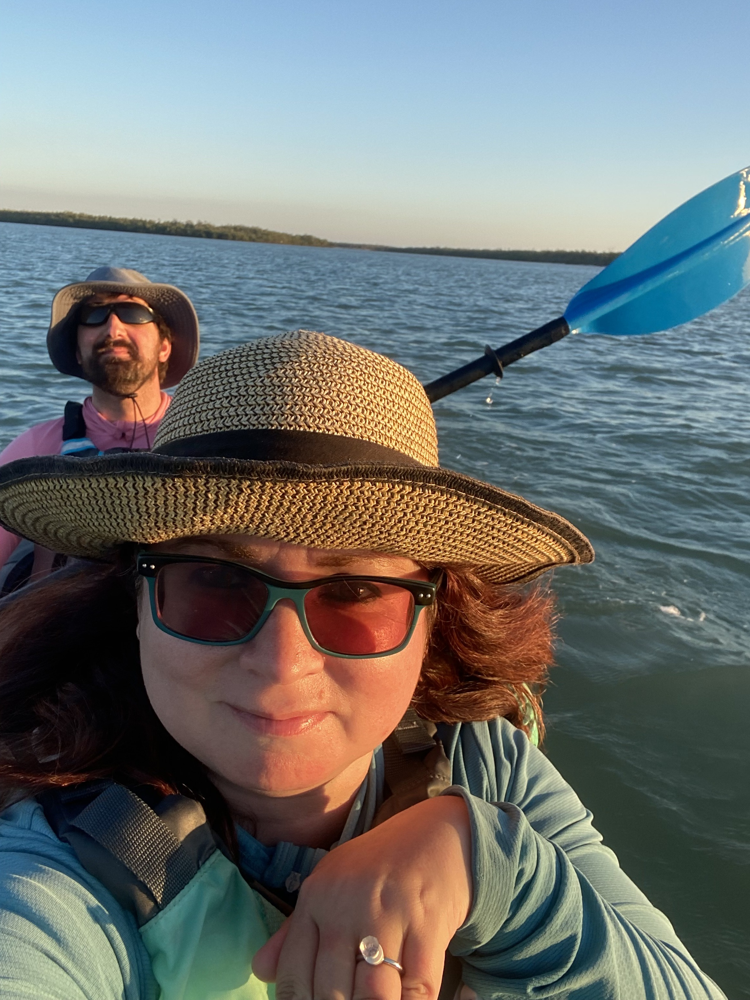

# Proposal Date: February 26th, 2025

I proposed to Suzie on Dickman’s Island which is part of the Ten Thousand Island Preserve near Marco Island, FL.
I found a beautiful conch shell in the water, put the LEGO ring in it, and asked if she wants to marry me.
She hugged me excitedly and said: “I love you!” and yes. :D

  
  

## Map of our Kayak Trip



### Dolphin Sighting after she said Yes!


